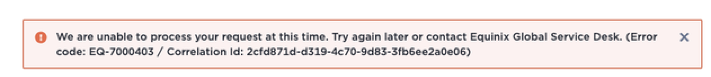

# Example Bug Report

### Title
User is not able to access the application, even the fact that has correct permissions assigned. 

### Affected versions
JUNE_2022_RELEASE

### Fix version
JUNE_2022_RELEASE

### Environment

__UAT-D:__ https://uat-d-portal.xxx.com/ecp/scx/orderflow/

__USER__: AKON.AGON@XXX.COM

### Steps to reproduce 
1. Go to a product page e.g. Console.
2. Assign the access rights to the desired user
3. Try to open the Portal app - app opens
4. Remove previously added access rights and re-assign them once again
5. Go to a product page and try to login once again.

### Current behaviour 
User is not able to access the application

### Expected behaviour 
User having the correct access rights should be able to open the application. 

### Relevant logs
[Kibana URL](https://some_kibana_url.xxx.com:port/app/kibana#/discover?) with detailed stacktrace
__CorrelationId:__ b92d4c2b-196d-4187-ac0c-ca421706615e

Important part of log: 

```
{"@timestamp":"2022-04-04T10:22:39.052Z","@version":"1", 
"message":"Open API Response Validation Failed: response: FeignResponseLogEntry(configKey=null, reason=null, status=0, 
Open API Response Validation Failed: response: FeignResponseLogEntry(configKey=null, reason=null, status=0, elapsedTime=null, method=GET, 
url=http://localhost:8080/users/TEST, headers=HeadersLog(headers=[]), body=null, length=2, operation=RESPONSE, type=OUTBOUND), 
reason: { "messages" : [ { "key" : "validation.response.status.unknown", "level" : "ERROR", "message" : "Response status 0 not defined for path '/users/{username}'.", "additionalInfo" : [ ], "nestedMessages" : [ ], "context" : { "empty" : false, "present" : true } } ] }
```

### Relevant screenshots


### Other comments

Possible tips:
- it was working fine on the first shot (2 BAs enabled and 2 BA available for ordering). Then when permissions have been adjusted by company admin (benjamin@xxx.com) and now it does not work properly.
- could be related to some permissions model changes done by TEAM X in the last Sprint - X.X.


------
### Reported by
Karol Kujawski
